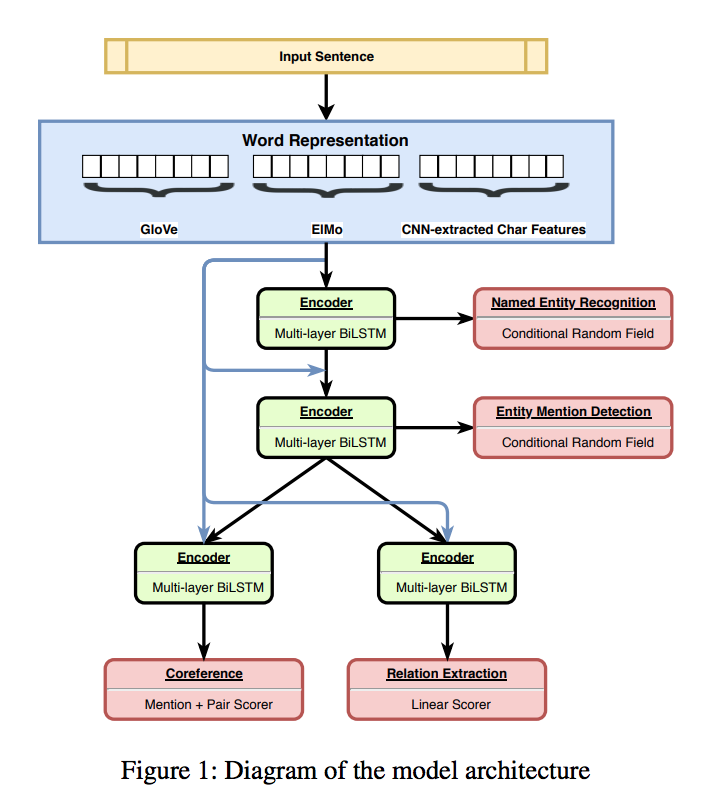

## 问题 Problem

训练层级多任务。
Perform multi-tasks in a hierarchical manner.

## 关键想法 Key Ideas

根据任务关系组合不同的任务，简单任务在下，复杂在上，下层任务对上层进行辅助。这里选择NER，EMD，CR，RE四个任务，分三层。NER-〉EMD-〉CR和RE

Construct task hierarchy according to their relation. Here choose NER, EMD (Entity Mention Detection), Coreference Resolution and Relation Extraction. NER-〉EMD-〉CR and RE

## Model

1. 结构 Structure
   Embedding： character emb + Glove + ELMo
   Encoder: Multi-layer BiLSTM for each task
   Decoder: CRF for NER and EMD, Scorer for CR and RE
2. 数据 Data
   利用标注好的不同训练数据
   Use different existing labeled training data
3. 训练 Training
   随机选择任务，选择batch
   Randomly select task, randomly select data batch.

## 技巧 Tricks

利用BILOU tagging，不是以前的BIO。
Use BILOU (Beginning, Inside, Last, Outside, Unit) tagging scheme.

## 效果 Performance

NER，EMD，RE三个任务达到SOTA

Get new SOTA performance for NER, EMD, RE.

## 评论 Comments

1. 建设任务层级有效果 Construct task hierarchichy is useful.
2. 多任务能加速训练 Multi-task can accelerate training.
3. 不同层embedding联合能提高效果 Combine different layer's embedding can help.

## Others

Paper link: <https://arxiv.org/pdf/1811.06031.pdf>

